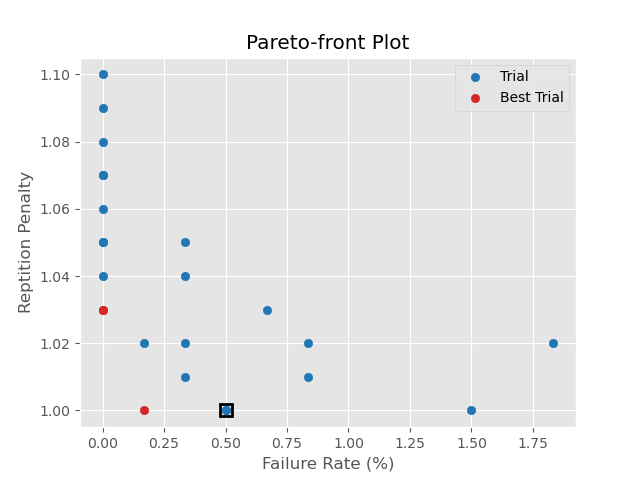
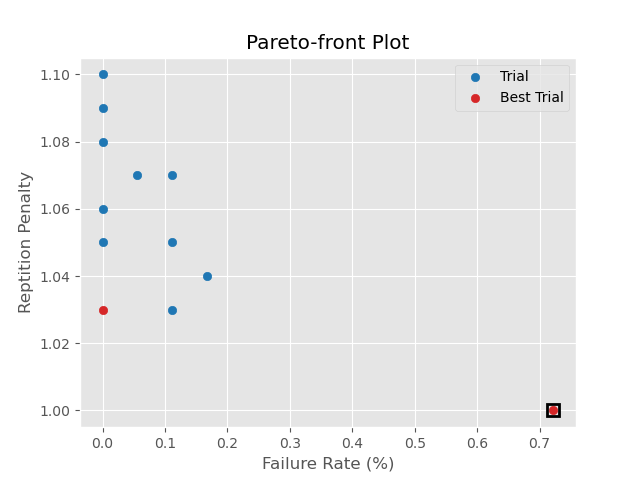

# Mad-Llama-Disease
Investigating Llama-3.1's penchant for failing to generate the end-of-string token and thus generating gibberish until the context window has been filled.

## Introduction

Large Language Models (LLMs) have become critical components in many organizations' tech stacks, powering everything from chatbots to automated workflows. However, running these models in production comes with its own set of challenges. In this blog post, I'll share our experience addressing a specific issue we've encountered with the Llama-3.1 model family: the occasional failure to generate an end-of-string (eos) token.

## The Problem

When running Llama-3.1 models in production (both 8B and 70B variants), we've observed an interesting failure mode where the model occasionally fails to generate an end-of-string token. This leads to the model continuing to generate tokens until it hits the maximum context window size of 128K tokens. This behavior creates two significant problems:

1. **Performance Impact**: Generating 128K tokens takes approximately 30 minutes, creating an unacceptable user experience.
2. **Stability Issues**: The extended generation fills up the GPU VRAM with the KV cache, eventually causing the container to crash. We observe this happening 7-10 times daily.

## Initial Mitigation

The most straightforward solution to this problem is setting the `max_tokens` parameter in the request. By limiting generation to something like 8,192 tokens, we can prevent the worst impacts of this failure mode. While this is a crucial first step that we recommend implementing immediately, we wanted to explore whether we could reduce the probability of this failure occurring in the first place by using a better set of sampling parameters.

## Optimization Experiment

We designed an optimization experiment to investigate how three key request sampling parameters may affect the failure rate of the LLM. Each trial in our experiment tests a specific combination of:

1. **temperature**: Controls sampling randomness (higher values = more random)
2. **min_p**: Sets the minimum probability threshold for token consideration
3. **repetition_penalty**: Penalizes tokens based on their previous appearances

We defined two objectives for our optimization:

1. **Primary**: Minimize the failure rate (percentage of requests generating `max_tokens` tokens)
2. **Secondary**: Minimize deviation from the default repetition_penalty value of 1.0

The second objective reflects our preference to keep parameters close to their defaults unless we see significant benefits from changing them.

### Methodology

The experiment used Optuna to optimize Llama-3.1's sampling parameters through a two-phase approach aimed at minimizing token generation failures. Here's how the optimization process worked:

Phase 1: Parameter Space Exploration
* The study explored three key sampling parameters:
  * Temperature (range: 0.7-0.9)
  * min_p (range: 0.0-0.1)
  * Repetition Penalty (range: 1.0-1.1)    
* Initial exploration consisted of 24 trials using Optuna's TPE Sampler
  * First trial are vLLM's defaults (temperature=0.7, min_p=0.0, repetition_penalty=1.0)
  * Next 9 trials are randomly selected
  * Final 14 trials are selected by the TPE Sampler
* Each trial simulated real-world conditions by:
  * Sending requests at an exponentially-distributed rate of 60 per minute
  * Total of 600 requests (~10 minutes), broken into 5 independent sets to prevent the LLM server from crashing
  * Using randomly sampled prompts asking for lengthy exam responses
  * Measuring failure rate based on percentage of requests whose number of generated tokens equaled `max_tokens` (8,192)

Phase 2: Deep Evaluation
* Selected the 10 most promising parameter combinations from Phase 1
  * Sorted Phase 1 trials by failure rate, repetition_penalty, min_p, and temperature to determine the most promising
* Ran these parameter combinations each for a total of 1,800 requests (~30 minutes) to refine failure rates
* Maintained vLLM's default parameters (temperature=0.7, min_p=0.0, repetition_penalty=1.0) as a baseline throughout

## 4-bit Quantized Llama-3.1-8B
In the production server, we run a 4-bit quantized version of the Llama-3.1 models. This saves significant GPU VRAM, optimize total token throughput, and has [limited impact](https://neuralmagic.com/blog/we-ran-over-half-a-million-evaluations-on-quantized-llms-heres-what-we-found/) on the model's outputs. Thus we begin our experiments with this version of the [Llama-3.1-8B model](https://huggingface.co/neuralmagic/Meta-Llama-3.1-70B-Instruct-quantized.w4a16).

### Phase 1

This image shows the Pareto plot for the 24 trials that were run. The trials that lie on the Pareto frontier
are colored red and those that do not are colored blue. The trial run with the vLLM defaults has a black box around it and notice that the vLLM defaults have a relatively high failure rate of 0.5% for Llama-3.1-8B. Note that there are actually three trials that lie on the Pareto frontier, but two of them have the exact same failure rate and repetition penalty (0.0, 1.03).

### Top Trials

As we see in the figure, there are a number of trials that had a failure rate of 0.0%. While we optimized to minimize both the failure rate and the repetition penalty, the failure rate is of much more importance to us.

The top candidates for phase 2's longer testing are shown in the table. The top two, in bold, are along the Pareto frontier while the vLLM default, in italics, is at the bottom for comparison purposes.

| Failure Rate (%) | Repetition Penalty |   min_p  | Temperature |
|:----------------:|:------------------:|:--------:|:-----------:|
|     **0.000**    |    **1.03**        | **0.00** |   **0.80**  |
|     **0.000**    |    **1.03**        | **0.03** |   **0.80**  |
|       0.000      |      1.04          |   0.03   |     0.80    |
|       0.000      |      1.05          |   0.06   |     0.85    |
|       0.000      |      1.05          |   0.07   |     0.90    |
|       0.000      |      1.06          |   0.01   |     0.90    |
|       0.000      |      1.07          |   0.02   |     0.90    |
|       0.000      |      1.07          |   0.10   |     0.85    |
|       0.000      |      1.08          |   0.10   |     0.75    |
|       0.000      |      1.09          |   0.05   |     0.85    |
|       0.000      |      1.1           |   0.03   |     0.70    |
|      *0.50*      |     *1.00*         |  *0.00*  |     0.70    |

## Phase 2
For the second phase of this work, we do a longer run on the parameters listed in the table above. For each configuration, we do 1800 requests (~30 minutes at our rate of 60 requests / minute). This is three times longer the trials in Phase 1 (600 requests for ~10 minutes).

For these longer runs, we see that some of the configurations' failure rates increases above 0.0 and that the vLLM default failure rate increases a little from 0.5% in phase 1 to 0.72% in phase 2.

This leaves us with the following parameter values that never encountered the failure to generate a stop token as shown in the table below. Again, we include the vLLM default (italics) for comparison.  Our recommended settings are the top choice (bold) since it needs just a small repetition penalty to stop the failures from occurring.

| Failure Rate (%) | Repetition Penalty |   min_p  | Temperature |
|:----------------:|:------------------:|:--------:|:-----------:|
|    **0.000**     |     **1.03**       | **0.00** |  **0.80**   |
|      0.000       |       1.05         |   0.07   |    0.90     |
|      0.000       |       1.06         |   0.01   |    0.90     |
|      0.000       |       1.08         |   0.10   |    0.75     |
|      0.000       |       1.09         |   0.05   |    0.85     |
|      0.000       |       1.10         |   0.03   |    0.70     |
|     *0.722*      |      *1.00*        |  *0.00*  |   *0.70*    |

## Implementation Recommendations

Based on our initial findings, we recommend a two-pronged approach:

1. **Immediate Action**: Implement max_tokens limit of 8,192 tokens to prevent system crashes
2. **Parameter Optimization**: Raise the temperature to 0.8 and apply a small repetition penalty of 1.03
