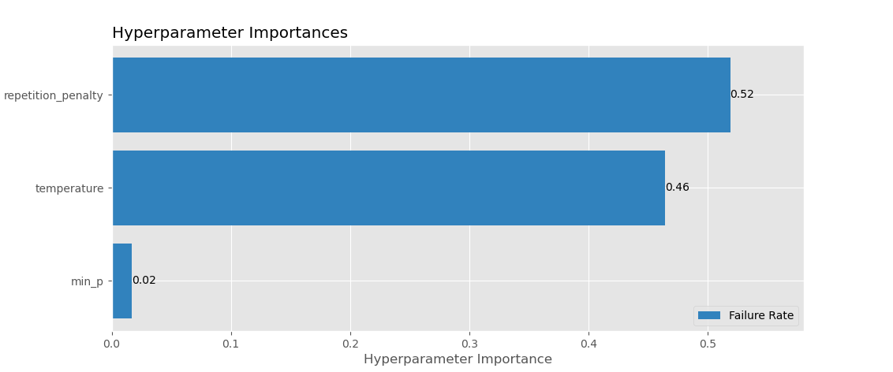
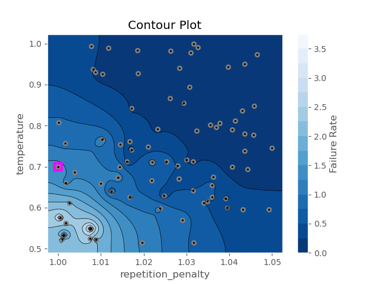
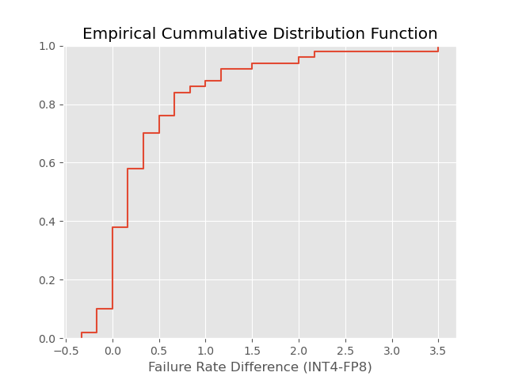
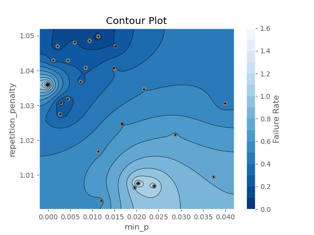
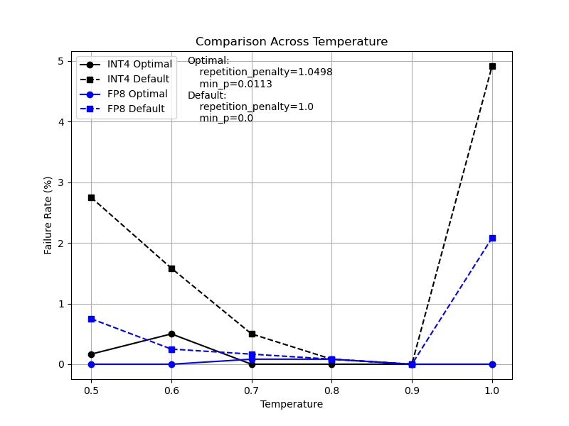

# Mad Llama Disease: Investigating and Fixing Endless Generation Issues in Llama-3.1

## Introduction

Large Language Models (LLMs) have become critical components in many organizations' tech stacks, powering everything from chatbots to automated workflows. However, running these models in production presents unique challenges. In this blog post, I'll share our experience addressing a specific issue with the Llama-3.1 model family: the occasional failure to generate an end-of-string (EOS) token.

## The Problem

Like many teams, we leverage the [vLLM engine](https://docs.vllm.ai) for running self-hosted LLMs in production. While running Llama-3.1 models (both 8B and 70B variants), we've observed an interesting failure mode, which others in the LLM community have observed as well, where the model occasionally fails to generate an end-of-string token. The model starts off generating acceptable outputs, but eventually degrades into endless gibberish. In vLLM, if a client does not provide the `max_tokens` (or `max_completion_tokens` for the OpenAI AI), which of course is nearly everyone, then [vLLM defaults](https://github.com/vllm-project/vllm/blob/730e9592e97c643474aa44e9d3dbe6f55c4b9ad9/vllm/entrypoints/openai/serving_chat.py#L190) to setting `max_tokens` equal to the size of the context window (128K for Llama-3.1 models) minus the number of prompt tokens. This results in two significant problems:

1. **Performance Impact**: Generating nearly 128K tokens of mostly gibberish takes approximately 30 minutes, creating an unacceptable user experience
2. **Stability Issues**: The extended generation fills up the KV cache, exhausting the GPU's VRAM, and eventually causing the container to crash (occurring 7-10 times daily)

## Initial Mitigation

The simplest solution is to set the `max_tokens` parameter in the request to a lower value. By limiting generation to 8,192 tokens, we can prevent the worst impacts of this failure mode. This aligns with major commercial models' limits:

* [Anthropic](https://docs.anthropic.com/en/docs/about-claude/models#model-comparison-table) (8192)
* [Gemini](https://cloud.google.com/vertex-ai/generative-ai/docs/learn/models#gemini-1.5-pro) (8192)
* [OpenAI](https://platform.openai.com/docs/models) (ranges from 4K-16K depending on the model)

Currently this would require adding this limit to every client's incoming request via a proxy server. While this is a crucial first step that we recommend implementing immediately, we wanted to explore whether we could reduce the probability of this failure through optimized sampling parameters.

## Initial Random Experiment
The initial phase of this work investigates the impact of three key sampling parameters on this particular failure mode. We selected the following parameters due to their popularity with clients (temperature) and from discussions on social media and Github issues to try and control this behavior:

1. **temperature**: Controls sampling randomness (higher values = more random)
2. **min_p**: Sets the minimum probability threshold for token consideration
3. **repetition_penalty**: Penalizes tokens based on their previous appearances in generated tokens

### Methodology
We conducted our experiments using a 4-bit quantized version of the Llama-3.1-8B model, which is used in our production service because it optimizes GPU VRAM usage and total token throughput while [maintaining model quality](https://neuralmagic.com/blog/we-ran-over-half-a-million-evaluations-on-quantized-llms-heres-what-we-found/). Our testing used [Optuna](https://optuna.readthedocs.io) to run a study using the `RandomSampler`.
 
* We explored the three sampling parameters within the following ranges:
  * temperature: 0.5 - 1.0
  * min_p: 0.0 - 0.04
  * repetition_penalty: 1.0 - 1.05
* Performed 81 trials
  * First trial used vLLM's defaults (temperature=0.7, min_p=0.0, repetition_penalty=1.0)
  * Remaining 80 trials were randomly sampled from uniform distributions within ranges listed above
* Each trial simulated real-world conditions by:
  * Sending requests at an exponentially-distributed rate of 75 per minute
  * Running a total 600 requests (~8 minutes) in 4 independent sets of 150
  * Using randomly sampled prompts requesting lengthy exam responses
  * Measuring failure rate based on percentage of requests hitting the max_tokens limit (8,192)

### Results
Optuna includes a number of visualizations of a study that we used to generate the following plots. The figure below shows a measure of the parameter importance in minimizing the failure rate, indicating that repetition_penalty and temperature have the strongest influence on preventing endless generation.

Given that the importance of repetition_penalty and temperature dominate over that of the min_p request parameter, let's examine the contour plot of these two parameters to see how they affect the failure rate.

Of the 81 trials, there are 22 trials that had a failure rate of 0.0. These are seen in the upper right corner of the contour plot. In comparison, the vLLM default values (highlighted with a magenta box) had a failure rate of 1.5%.

## Effect of Model Quantization
Our use of 4-bit quantization raises an important question: could the quantization itself be contributing to the failure rate? To investigate this possibility, we conducted a comparative analysis by rerunning the first 50 trials using both our 4-bit quantized model and an [FP8 quantized Llama-3.1-8B](https://huggingface.co/neuralmagic/Meta-Llama-3.1-8B-Instruct-FP8).

Here is the contingency table for the overall success/failure counts between the two models across the 50 trials in common.

| Model | Success | Failure | Failure Rate (%) |
|:-----:|:-------:|:-------:|:----------------:|
| INT4  | 29,834  |  166    |    0.553         |
| FP8   | 29,955  |   45    |    0.150         |

Using Fisher's Exact Test, we can reject the null hypothesis that the INT4 & FP8 failure rates are the same with a p-value of 1.52e-17. We do see that using INT4 quantization does increase the failure rate by ~3.7x, but even using the FP8 model the failure rate is still not zero across the randomly selected request parameters in the study.

Here is the empirical cumulative distribution of the difference between the INT4 failure rate and the FP8 failure rate over the 50 trials.

There are a few trials where the INT4 failure rate was lower than the FP8, but as we can see the majority of the time the INT4 failure rate exceeds the FP8 failure rate.

## Temperature Robustness Experiment
Though the previous experiment showed that using a higher temperature would lower the failure rate, the temperature request parameter is the mostly likely parameter to be set by clients who will set it according to their needs. Thus, we would like to find an optimal min_p and repetition_penalty that minimizes the failure rate across the entire range of temperatures (0.5 - 1.0) that are most likely to be set by clients.

For this experiment, we make the following modifications:

1. Use Optuna's TPESampler that minimizes the failure rate using just min_p and repetition_penalty.
2. Each trial (given min_p and repetition_penalty) will submit requests where the temperature for each request is uniformly sampled from temperatures that span the entire [0.5, 1.0] range.
3. Increase the total number of requests to 1,800
4. Perform a total of 24 trials with `n_startup_trials` = 10 (TPESampler's default)

### Results
Given that the random experiment showed that a repetition_penalty near 1.05 provided failure rates of 0.0 for a large swath of temperatures (~0.65 - 1.0) it's not surprising that for this study the following optimal values were found to be:
* **min_p = 0.0113**
* **repetition_penalty = 1.0498**

These were the only values that managed to have a failure rate of 0.0% across the 1,800 requests evenly spaced across the temperature range.

The contour plot shows that we are better off picking a relative small value for the min_p, ~0.015 or less, which fits well with reported values for improved LLM outputs.

## Comparison Experiment
In our final experiment, we compare the performance of using the default min_p and repetition_penalty (0.0 and 1.0, respectively) compared to using the optimal values found in the temperature robustness experiment. For this work we simply measure the failure rate for both sets of min_p/repetition_penalty for temperatures ranging from [0.5, 1.0]. We perform 1,200 total requests for a given trial.

This figure shows the dramatic improvement in the failure rate across the entire range of temperatures (0.5 - 1.0). Shockingly, the default parameters at temperature 1.0 have a very high failure rate of 4.92% which required doing a separate run in order to ensure we didn't run out of GPU VRAM.

The contingency table statistically validates the improvement of the optimal over the default parameters for min_p and repetition_penalty across the various temperatures.

| Config | Success | Failure | Failure Rate (%) |
|:-----:|:-------:|:-------:|:----------------:|
| Optimal  | 7,192  |  8    |    0.111         |
| Defaults   | 7,082  |   118    |    1.639         |

Using Fisher's Exact Test, we can reject the null hypothesis that the optimal parameters and default parameter failure rates are the same with a p-value of 2e-26.

## Implementation Recommendations

Based on our findings, we recommend a two-step approach:

1. **Immediate Action**: Set the `max_tokens` request parameter for all client requests to 8,192 tokens to reduce the likelihood of a system crash
2. **Parameter Optimization**: Set min_p=0.0113 and repetition_penalty=1.0498, which achieved lowest failure rate across all temperatures between 0.5 and 1.0, for all client requests

Though restricting `max_tokens` to 8,192 will help, if the failure rate is high enough and traffic to the serve is high enough, then the system may still crash. We note that the temperature=1.0, min_p=0.0, and repetition_penalty=1.0 had a high enough failure rate to force us to alter request rates to enable the trial to complete without crashing the vLLM server.

## Future Steps
These experiments did not take into account the request parameters' effect on the quality of the LLMs output. A natural next step would be to use the optimal request parameters found on the various LLM benchmarks to ensure that there isn't a noticeable drop in performance. This would be similar to what Neural Magic did with their [quantization study](https://neuralmagic.com/blog/we-ran-over-half-a-million-evaluations-on-quantized-llms-heres-what-we-found/).